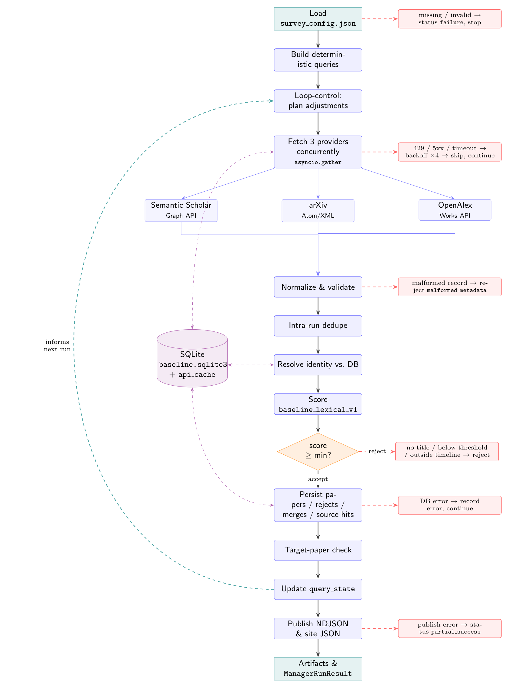

# Dynamic-LR

Dynamic literature retrieval and survey-management system. It compares
automation architectures for literature-survey workflows and asks one research
question:

> Does LLM-based sequential decision-making improve a literature-survey workflow
> compared with a strong deterministic, multi-source API-driven baseline?

---

## Architectures

| Architecture | Description | Status |
|---|---|---|
| `baseline` | Deterministic, non-LLM, three-provider pipeline | **Active** |
| `single-agent` | LLM sequential decision-making | Placeholder |
| `multi-agent` | LLM multi-agent coordination | Placeholder |

The baseline is the primary engineering artifact in this repository. It must be
a competent, auditable retrieval-and-curation system whose results are
inspectable, replayable, and directly comparable to the agent architectures.

---

## Quick start

```bash
# Deterministic baseline, no file writes (in-memory DB):
python -m app.run --architecture baseline --dry-run --verbose

# Full baseline run (writes SQLite, NDJSON, site data, and per-run artifacts):
python -m app.run --architecture baseline

# Agent architectures (placeholders, preserved for comparison):
python -m app.run --architecture single-agent --dry-run
python -m app.run --architecture multi-agent --dry-run

# Tests (fixture API responses, no network):
pytest tests/baseline -q
```

Configuration lives in `data/survey_config.json`. The baseline runtime is
stdlib-only (`urllib`, `sqlite3`, `json`, `xml`, `dataclasses`). `pytest` is the
only dev dependency. `httpx` and `asyncio` are required for the three-provider
async fetch path.

> **Rate limits.** Without `SEMANTIC_SCHOLAR_API_KEY` the S2 Graph API throttles
> hard (HTTP 429). The pipeline degrades gracefully (see
> [Situation handling](#situation-handling)) and the SQLite response cache makes
> re-runs progressively cheaper. Set the key for full throughput. OpenAlex is
> free and keyless. arXiv requires a polite User-Agent and a minimum request
> interval.

---

## Pipeline at a glance

The baseline is an **automated loop**, not a one-off search script. Each run
reads the survey config, retrieves metadata from three providers concurrently,
normalizes and deduplicates it, scores candidates deterministically, persists
everything to a local SQLite source-of-truth, publishes the static-site data,
and records enough state that the **next** run can adapt by fixed rules.



*Solid black = happy path. Dashed red = fail-soft exits (error recorded, run
continues). Dashed violet = SQLite reads/writes (including response cache).
Dashed teal = feedback edge: per-query outcomes written to `query_state` feed
the next run's loop-control.*

The source is `docs/pipeline.tex` (TikZ/LaTeX, `standalone` class). Re-compile
with `pdflatex docs/pipeline.tex` if you edit it.

### Three-layer separation

```text
Acquisition  →  query planning, API calls, raw caching, normalization,
                identifier resolution, deduplication

Curation     →  eligibility filters, relevance scoring, screening decisions,
                evidence extraction, human overrides

Presentation →  NDJSON/JSON exports, static site files, run comparison reports
```

No layer may silently perform another layer's job. Acquisition never makes an
unlogged relevance decision. Curation never calls providers directly. Presentation
artifacts are projections, not the sole source of truth.

---

## Provider coverage

All three providers are queried for every canonical query by fixed policy:

| Provider | API | Auth | Pagination | Notes |
|---|---|---|---|---|
| Semantic Scholar | Graph API v1 | API key (optional) | `offset` + `limit` | Rich metadata, citation counts, fields of study |
| arXiv | Atom/XML query API | None (User-Agent + interval) | `start` + `max_results` | Preprint coverage; date-filter is per-record |
| OpenAlex | Works API | None (polite pool) | Cursor (`cursor=*`) | Broadest coverage; inverted-index abstracts |

Provider queries are generated by a deterministic translation layer
(`query_translation.py`) that converts each canonical query into a
provider-specific form. S2 uses plain text; arXiv uses `all:term AND all:term`
syntax; OpenAlex uses the `search=` parameter with configured filters. The
translation is versioned and recorded in run artifacts.

---

## Stage-by-stage

Each stage maps to one module under `app/architectures/baseline/`.

1. **Load config** (`app/config.py`). Parses `survey_config.json` into a
   `SurveyConfig`. Documented fields are first-class; optional blocks
   (`baseline`, `semantic_scholar`, `arxiv`, `openalex`, `target_papers`,
   `evaluation`) are read with safe defaults so missing keys never raise. A
   missing/invalid file is the only hard-stop failure.

2. **Build canonical queries** (`query_builder.py`). Deterministic, no LLM.
   Rules: `topic_overview`, then each `research_question`, then each
   `query_hint`, then one **combined** query built from the top non-stopword
   tokens (ranked by frequency, ties broken alphabetically). Queries are
   cleaned, deduplicated case-insensitively, and capped at
   `baseline.max_queries`. Stable `query_id`s are assigned before translation.

3. **Translate queries per provider** (`query_translation.py`). Converts each
   canonical query to provider-specific syntax. Translations are logged in
   `canonical_query_plan.json` and `provider_query_plan.json` artifacts.

4. **Loop-control: plan adjustments** (`loop_control.py`). Reads `query_state`
   from prior runs and decides deterministic adjustments before any network call
   (see [Loop engineering](#loop-engineering)).

5. **Fetch three providers concurrently** (`providers/`). An `asyncio.gather`
   call dispatches Semantic Scholar, arXiv, and OpenAlex in parallel, each with
   its own rate limiter, retry policy, and cache TTL. Provider failures are
   isolated — one provider timing out does not abort the others and yields
   `partial_success`. Raw responses (JSON or Atom XML) are stored in the SQLite
   `api_cache` table and keyed by a hash of source + endpoint + params +
   requested fields.

   Retry policy:
   - Respect `Retry-After` when provided.
   - Retry transient 429, 500, 502, 503, 504 responses with exponential
     backoff.
   - Deterministic jitter: `hash(run_id + provider + fingerprint + attempt) %
     max_jitter_ms` — never calls an unseeded random generator.
   - Permanent errors (4xx validation failures, malformed syntax) are classified
     and not retried.

6. **Normalize & validate** (`normalizer.py`, `validator.py`). Per-provider
   normalizers convert raw records into the shared `PaperCandidate` shape:
   - S2: preserve `paperId`, `corpusId`, external IDs, citation fields,
     fields of study, open-access PDF info.
   - arXiv: parse Atom entries — arXiv ID/version, title, summary, categories,
     `published`/`updated`, DOI when present.
   - OpenAlex: reconstruct abstract from `abstract_inverted_index`
     deterministically (sort positions, join tokens). Preserve work ID, DOI,
     type, open-access locations, retracted/paratext flags.

   Missing abstract or PDF URL is **not** a rejection reason. Missing title is.

7. **Identity resolution & deduplication** (`identity.py`, `deduper.py`).
   Priority chain for matching:

   ```text
   1. normalized DOI
   2. normalized arXiv ID (version stripped)
   3. normalized OpenAlex work ID
   4. Semantic Scholar paperId
   5. Semantic Scholar corpusId
   6. PMID / ACL / MAG
   7. title + year + first-author fingerprint (SHA-256)
   8. fuzzy title → possible_duplicate / identity_conflict_needs_review
   ```

   Level 8 produces a flag, never an auto-merge. A false merge is worse than a
   retained duplicate. Merge metadata is preserved field-by-field with "never
   overwrite good data with null" rules.

8. **Score** (`scorer.py`). Transparent lexical + metadata formula,
   `baseline_lexical_v1`, all components stored on the record:

   ```text
   score = 0.35 × title_keyword_overlap
         + 0.30 × abstract_keyword_overlap
         + 0.15 × query_phrase_match
         + 0.10 × recency_score
         + 0.05 × identifier_score
         + 0.05 × citation_score   (log-normalized, capped)
   ```

   All components normalized to `[0, 1]`. Every decision is explainable.

9. **Filter** (`filters.py`). Two staged gates written as
   `ScreeningDecision` records:
   - **Stage `metadata_filter`**: missing title, malformed metadata, retracted
     work, paratext, unsupported document type.
   - **Stage `baseline_score`**: score < `min_relevance_score`, outside timeline
     (when strict mode enabled), confirmed duplicate.

   Every reject is persisted with a closed-vocabulary reason and evidence
   (threshold, matched/missing terms). Accepted papers are sorted
   deterministically (score desc, then `paper_key`).

10. **Persist** (`db.py`). One transaction: upsert accepted papers, append
    `retrieval_events`, record `merge_events`, and write `screening_decisions`.
    Identifiers are stored in a separate `paper_identifiers` table (indexed,
    unique per `id_type + id_normalized`). All writes are transactional; file
    exports are atomic (`*.tmp` + `os.replace`).

11. **Target-paper check** (`target_check.py`). For each configured target,
    resolve by DOI → S2 id → arXiv → OpenAlex → exact normalized title →
    quoted-title API search. Reports `found`, `was_accepted`, `found_by`, and
    `rejection_reason`.

12. **Update `query_state`** (`loop_control.py`). Persist this run's per-query
    outcomes — the feedback edge in the diagram.

13. **Publish** (`publisher.py`). Export the canonical SQLite state to
    `data/*.ndjson`, `data/changelog.md`, `data/system_status.json`, and
    `site/data/*.json`, attaching a `provenance` block per paper (which
    architectures, sources, and queries observed it). Atomic writes throughout.

14. **Artifacts & result** (`pipeline.py`, `metrics.py`). Write per-run
    artifacts under `data/baseline/run_artifacts/{run_id}/` and a comparison
    record under `data/comparison/runs/`, then return a flat `ManagerRunResult`.

---

## Situation handling

The baseline **fails soft**: one bad query or provider failure must never kill
the run, and publishing problems must never corrupt existing output.

| Situation | Detection | Response | Status effect |
|---|---|---|---|
| Config missing / invalid | `ConfigError` | Stop immediately | `failure` |
| No queries generated | empty list | Stop with clear error | `failure` |
| Rate limited (429) | `RateLimitError` | Backoff with deterministic jitter, up to 4 attempts; skip query if still failing | `partial_success` |
| Server error (5xx) / timeout | `APIResponseError` | Same retry/backoff, then skip | `partial_success` |
| Invalid JSON/XML body | `APIResponseError` | Treated as failed attempt; retried then skipped | `partial_success` |
| One provider entirely down | provider exception | Record error; other providers continue | `partial_success` |
| Malformed / unrecoverable record | validator verdict | Reject as `malformed_metadata`; continue | unaffected |
| Missing title / below threshold | `filters` | Reject with reason + evidence; continue | normal |
| Fuzzy-title identity conflict | identity resolution | Flag as `possible_duplicate`; no auto-merge | normal |
| Candidate cap reached | counter | Stop further queries; log clearly | `partial_success` |
| SQLite write error | `DatabaseWriteError` | Record; continue | `partial_success` |
| Publish/export error | `PublishError` | Report; never overwrite good files | `partial_success` |

Final status is `success`, `partial_success`, or `failure`. A summary is always
written, even on partial failure.

---

## Loop engineering

The baseline is a **repeatable, self-improving loop** governed by a transparent
state machine — explicitly not a hidden agent. State persists across runs in
SQLite:

- `query_state` — per query: totals (candidates / accepted / duplicates /
  errors), `consecutive_zero_accept`, `last_run_at`.
- `runs` — per run: generated queries, metrics, errors, manifest.
- `api_cache` — raw responses keyed by hash of (source + endpoint + params).
- `retrieval_events` / `merge_events` / `screening_decisions` — complete audit
  trail.

**The loop (one turn of the diagram's feedback edge):**

```text
plan_adjustments(query_state)   # before crawling — adapt this run
        │
        ▼
   run the pipeline             # fetch → normalize → dedup → score → persist
        │
        ▼
record_query_outcomes(...)      # after persisting — write query_state
        │
        └──────────────► feeds the next run's plan_adjustments
```

**Deterministic rules** (`loop_control.py`; thresholds are named constants):

- **Dead-query deprioritization** — a query with `consecutive_zero_accept ≥ 3`
  is dropped from the upcoming run's plan (with a guard so the run is never left
  with zero queries).
- **Prefer recency when duplicate-heavy** *(hook)* — when `duplicate_rate >
  0.80`, favor newer publication-date filtering next time.
- **Enable hints + combined when yield is low** *(hook)* — when accepted count
  falls below the expected minimum, ensure hint and combined queries are
  included.
- **Throttle on frequent 429s** *(hook)* — reduce request rate/concurrency when
  rate-limit events exceed threshold.
- **Target fallback lookups** — when configured `target_papers` are not found,
  fall back through DOI / S2-id / arXiv / OpenAlex / exact-title / quoted-title.

Every rule produces a human-readable note in the run's adjustments. New rules
belong in `loop_control.py`, never scattered through the pipeline.

---

## Determinism

Given the same config, database state, and API responses, the baseline produces
identical output:

- query generation, scoring, filtering, and identity keys are pure functions of
  their inputs;
- jitter is derived deterministically from `hash(run_id + provider + fingerprint
  + attempt)`;
- all outputs are sorted before every write;
- the `api_cache` replays identical responses, removing network nondeterminism;
- stable `paper_key` prefixes: `doi:` / `arxiv:` / `openalex:` / `s2:` /
  `corpus:` / `fp:`.

No LLM is used anywhere in the baseline path. A fixed, versioned non-LLM
embedding scorer (SBERT) may be added later strictly as a scoring function — it
does not violate determinism because fixed model weights produce identical
vectors for identical input.

---

## Outputs

Canonical, shared across architectures:

```text
data/papers.ndjson          data/run_history.ndjson     data/system_status.json
data/rejects.ndjson         data/changelog.md
site/data/*.json            site/data/changelog.md
```

Baseline-specific (debugging / evaluation):

```text
data/baseline/baseline.sqlite3
data/baseline/run_artifacts/{run_id}/
    run_manifest.json             canonical_query_plan.json
    provider_query_plan.json      provider_results/
    normalized_candidates.json    dedupe_results.json
    screening_decisions.json      accepted_candidates.json
    rejected_candidates.json      merge_events.json
    target_check.json             metrics.json
    errors.json                   final_report.json
data/comparison/runs/{run_id}.json
```

Comparison and evaluation:

```text
data/comparison/
    frozen_corpora/{corpus_id}/   # shared corpus snapshot for architecture comparison
    runs/{comparison_id}.json
    metrics/
        architecture_summary.json
        baseline_vs_single_agent.json
        baseline_vs_multi_agent.json
```

Open `site/index.html` to browse accepted papers (reads `site/data/papers.json`
and `system_status.json`).

---

## Baseline comparison report

`baseline_comparison/baseline_comparison.html` is a bilingual (EN / 中文)
deep-dive comparison of three literature-retrieval systems:

| System | Description |
|---|---|
| **Dynamic-LR** | This repo — deterministic, SQLite-backed, three-provider |
| **PRS** | `cherryann518/paper-retrieval-system` — S2 + arXiv, SBERT, optional Ollama |
| **PF** | `WoosungLim01/Paper-Feed` — S2 + arXiv + OpenAlex async, SBERT + FAISS |

The report covers all 11 pipeline stages, a feature matrix, and 10 ranked
synthesis recommendations that informed the current CLAUDE.md contract. It is
grounded in:

- *InsightAgent* (arXiv:2504.14822)
- *Agentic AutoSurvey* (arXiv:2509.18661)
- *LatteReview* (arXiv:2501.05468)

---

## Configuration reference

`data/survey_config.json` — key fields:

| Field | Meaning |
|---|---|
| `topic_overview` | Primary topic; seeds a query and the combined query |
| `research_questions` | One canonical query each |
| `query_hints` | One canonical query each |
| `timeline_from_year` / `timeline_to_year` | Recency scoring window; strict filter when enabled |
| `min_relevance_score` | Accept threshold |
| `target_papers` | Optional accuracy targets (`title`/`doi`/`arxiv_id`/`semantic_scholar_id`/`openalex_id`/`must_find`) |
| `baseline.*` | `max_queries`, `max_results_per_query`, `max_candidates_per_run`, `strict_timeline_filter`, `enable_raw_cache`, `deterministic_seed`, `retry_jitter_mode`, … |
| `sources.enabled` | Which providers to activate (`semantic_scholar`, `arxiv`, `openalex`) |
| `semantic_scholar.*` | Fields requested from the API, per-query result cap, cache TTL |
| `arxiv.*` | `max_results_per_query`, `min_request_interval_seconds`, categories, sort order |
| `openalex.*` | `per_page`, `work_types`, `exclude_retracted`, `sort`, cursor pagination |

Environment variables:

```text
SEMANTIC_SCHOLAR_API_KEY
SEMANTIC_SCHOLAR_BASE_URL=https://api.semanticscholar.org/graph/v1
ARXIV_API_BASE_URL=https://export.arxiv.org/api/query
OPENALEX_BASE_URL=https://api.openalex.org
REQUEST_TIMEOUT_S=30
BASELINE_SQLITE_PATH=data/baseline/baseline.sqlite3
```

---

## CLI & dry-run semantics

```bash
python -m app.run --architecture {baseline|single-agent|multi-agent} \
    [--config data/survey_config.json] [--dry-run] [--verbose]
```

`--dry-run` runs the full pipeline against an **in-memory** database and writes
no files (artifacts, NDJSON, and site data are all skipped). The baseline never
commits or pushes to git.

---

## File structure

```text
app/
  architectures/
    baseline/
      pipeline.py           run orchestration, checkpoints, structured result
      query_builder.py      deterministic canonical query generation
      query_translation.py  provider-specific query syntax translation
      normalizer.py         per-provider normalization dispatch
      validator.py          field validation and minor repairs
      identity.py           identifier normalization, stable paper_key
      deduper.py            intra-run + cross-DB deduplication, merge events
      scorer.py             lexical relevance scoring (baseline_lexical_v1)
      filters.py            staged eligibility + threshold filtering
      db.py                 SQLite schema, migrations, transactions
      publisher.py          NDJSON + site/data atomic exports
      loop_control.py       deterministic cross-run feedback rules
      target_check.py       target paper fallback detection chain
      metrics.py            run, query, provider, and comparison metrics
      errors.py             structured error hierarchy
      models.py             dataclasses: PaperCandidate, ScreeningDecision, …
      constants.py          named thresholds and policy versions
      providers/
        base.py             LiteratureProvider protocol
        semantic_scholar.py S2 async client
        arxiv.py            arXiv Atom XML client
        openalex.py         OpenAlex cursor-paginated client
        cache.py            BLOB-aware TTL cache (SQLite api_cache)
        rate_limit.py       per-provider semaphore + token bucket

data/
  survey_config.json        survey topic, questions, hints, thresholds
  papers.ndjson             accepted papers (shared export)
  rejects.ndjson            rejected candidates (shared export)
  run_history.ndjson        run summaries (shared export)
  changelog.md              human-readable change log
  system_status.json        current pipeline status
  baseline/
    baseline.sqlite3        authoritative source of truth
    run_artifacts/{run_id}/ per-run artifacts
  comparison/               cross-architecture evaluation artifacts

docs/
  pipeline.tex              TikZ source for the pipeline diagram
  pipeline.png              rendered diagram (embedded above)
  baseline_technical.md     extended technical notes
  qa_scoring_database_queries.md

baseline_comparison/
  baseline_comparison.html  bilingual system comparison report (EN / 中文)
  baseline_comparison.md    source comparison document
```

---

See `CLAUDE.md` for the full specification and `baseline_comparison/baseline_comparison.html`
for the architecture comparison that informed the design. The baseline is
**strong, transparent, reproducible, and boring** — so that any improvement from
the agent architectures has to be earned rather than assumed.
